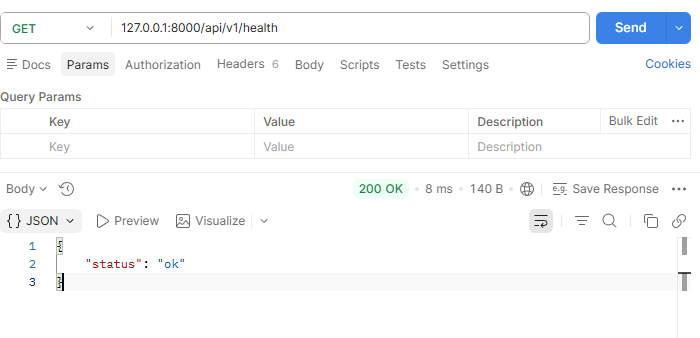
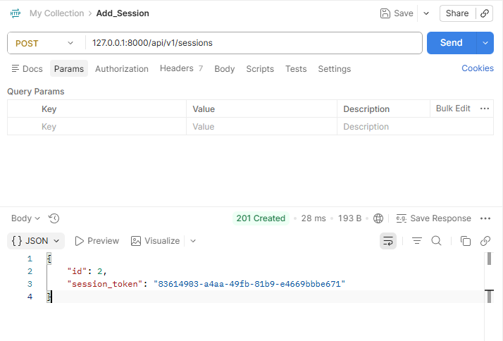
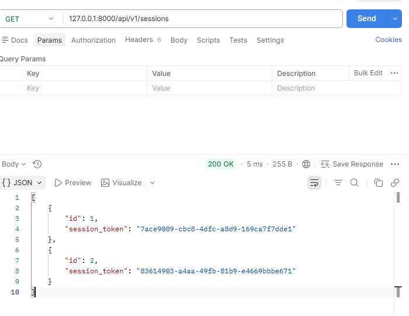
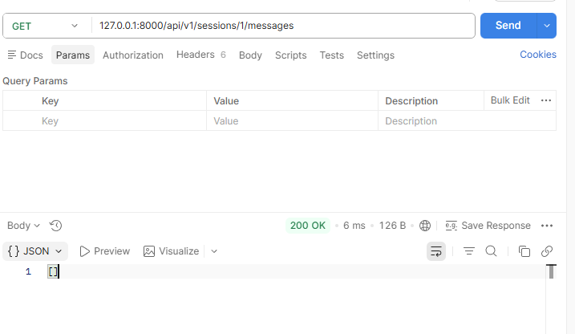
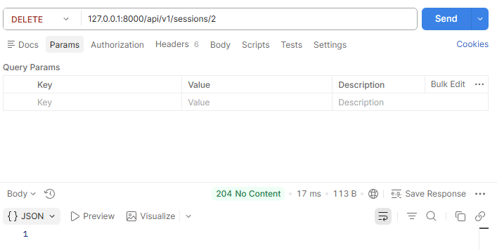
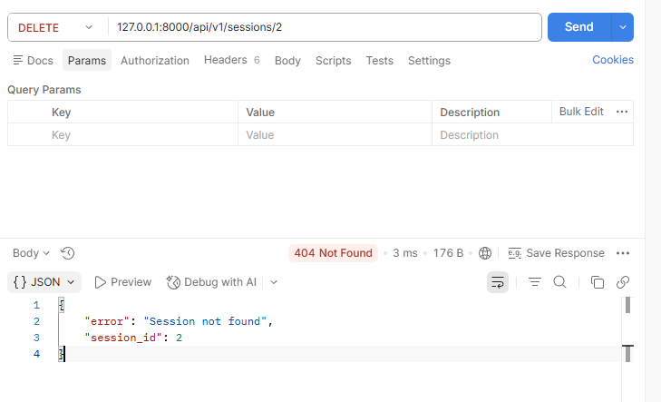
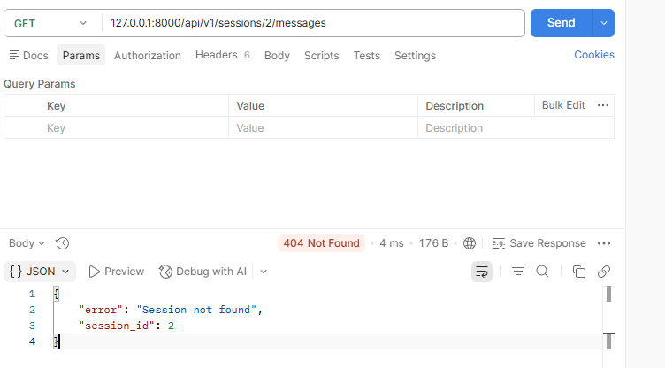

# ESBot API – Manual Test Summary

 Findings:
- All tests returned the expected error code.
- the messages api is not useful because there is no endpoint for message creation implemented.
- The error codes provide enough feedback to pinpoint the underlying errors

---

## GET /api/v1/health

---

## POST /api/v1/sessions

---

## GET /api/v1/sessions

---

## GET /api/v1/sessions/{session_id}/messages

---

## DELETE /api/v1/sessions/{session_id}

---

## DELETE /api/v1/sessions/{session_id} for non-existing session

---
## GET /api/v1/sessions/{session_id}/messages for non-existing session

---
