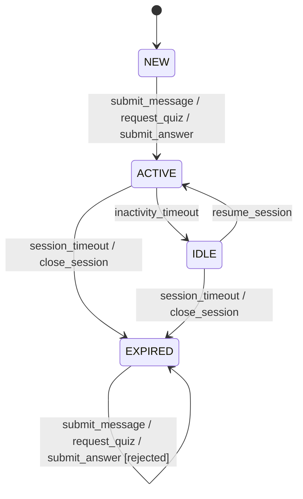

## 7.1

### Step 1 - Identify Valid and Invalid Equivalence Classes

The relevant validation rules for a QuizRequest are:

    Topic length: The topic string must be between 3 and 100 characters (inclusive).
    Requested question count: Must be an integer between 1 and 10 (inclusive).
    Difficulty hint: Must be one of the accepted values: easy, medium, or hard. Any other value (including blank/null) is invalid.

For each of the three input parameters of `QuizRequest` (`topic`, `count`, `difficulty`),
identify all **valid** and **invalid equivalence classes**.

##### Parameter: `topic`

| Parameter | Class ID | Class Type | Partition Description | Representative Test Value |
|-----------|----------|------------|-----------------------|---------------------------|
| `topic`   | EC-T-1   | Valid      | String length between 3 and 100 characters (inclusive) | `"Java"` |
| `topic`   | EC-T-2   | Invalid    | String length less than 3 characters | `"Go"` |
| `topic`   | EC-T-3   | Invalid    | String length greater than 100 characters | `"A"` repeated 101 times |
| `topic`   | EC-T-4   | Invalid    | Empty string | `""` |
| `topic`   | EC-T-5   | Invalid    | Null / missing value | `null` |

##### Parameter: `count`

| Parameter | Class ID | Class Type | Partition Description | Representative Test Value |
|-----------|----------|------------|-----------------------|---------------------------|
| `count`   | EC-C-1   | Valid      | Integer between 1 and 10 (inclusive) | `5` |
| `count`   | EC-C-2   | Invalid    | Integer less than 1 (zero or negative) | `0` |
| `count`   | EC-C-3   | Invalid    | Integer greater than 10 | `11` |
| `count`   | EC-C-4   | Invalid    | Wrong type (non-integer, e.g. string or decimal) | `"abc"` |
| `count`   | EC-C-5   | Invalid    | Null / missing value | `null` |

##### Parameter: `difficulty`

| Parameter   | Class ID | Class Type | Partition Description | Representative Test Value |
|-------------|----------|------------|-----------------------|---------------------------|
| `difficulty`| EC-D-1   | Valid      | Accepted value `"easy"` | `"easy"` |
| `difficulty`| EC-D-2   | Valid      | Accepted value `"medium"` | `"medium"` |
| `difficulty`| EC-D-3   | Valid      | Accepted value `"hard"` | `"hard"` |
| `difficulty`| EC-D-4   | Invalid    | Any other non-empty string (incl. wrong case, typos) | `"Easy"` |
| `difficulty`| EC-D-5   | Invalid    | Empty string | `""` |
| `difficulty`| EC-D-6   | Invalid    | Null / missing value | `null` |

### Step 2 - Justify Each Class

##### Parameter: `topic`

**EC-T-1: `"Java"`**
1. 4 characters, mid-range in [3,100], so it stands for any valid length without sitting on a boundary.
2. Contains both boundaries. Lower: **3** (`"abc"`), upper: **100** (`"A"` x 100); just outside: **2** (`"ab"`) and **101** (`"A"` x 101).
3. Requirements: FR-3, NFR-7

**EC-T-2: `"Go"`**
1. Length 2 violates the minimum of 3, representing all strings too short to pass.
2. Boundary-touching. Upper end of class: length **2**; just outside (back into valid): length **3**.
3. Requirements: NFR-7

**EC-T-3: `"A"` x 101**
1. Length 101 exceeds the maximum of 100, representing all over-long strings.
2. Boundary-touching. Lower end of class: length **101**; just outside (back into valid): length **100**.
3. Requirements: NFR-7

**EC-T-4: `""`**
1. Empty string is a separate edge case typically caught by a distinct blank-check rule.
2. Degenerate boundary at length **0**; no further bounds.
3. Requirements: NFR-7

**EC-T-5: `null`**
1. Missing value, semantically different from empty string and explicitly invalid per spec.
2. No numeric boundary, type-level class.
3. Requirements: NFR-7

##### Parameter: `count`

**EC-C-1: `5`**
1. Mid-range in [1,10], so it stands for any valid integer without sitting on a boundary.
2. Contains both boundaries. Lower: **1**, upper: **10**; just outside: **0** and **11**.
3. Requirements: FR-3, NFR-7

**EC-C-2: `0`**
1. Below the lower bound, representing all values <= 0.
2. Boundary-touching. Upper end of class: **0**; just outside (back into valid): **1**.
3. Requirements: NFR-7

**EC-C-3: `11`**
1. Above the upper bound, representing all values > 10.
2. Boundary-touching. Lower end of class: **11**; just outside (back into valid): **10**.
3. Requirements: NFR-7

**EC-C-4: `"abc"`**
1. Wrong type, violating the integer requirement, a distinct error category from range violations.
2. No numeric boundary, type-level class.
3. Requirements: NFR-7

**EC-C-5: `null`**
1. Missing value, rejected independently of type or range.
2. No numeric boundary, type-level class.
3. Requirements: NFR-7 

##### Parameter: `difficulty`

**EC-D-1: `"easy"`**
1. Explicitly accepted enum value and the only member of its class.
2. No boundary analysis applicable, discrete enum point.
3. Requirements: FR-3, NFR-7

**EC-D-2: `"medium"`**
1. Explicitly accepted enum value, sole member of its class.
2. No boundary, discrete enum point.
3. Requirements: NFR-7

**EC-D-3: `"hard"`**
1. Explicitly accepted enum value, sole member of its class.
2. No boundary, discrete enum point.
3. Requirements: NFR-7

**EC-D-4: `"Easy"`**
1. Wrong casing represents all non-accepted strings (typos, case mismatches), since the spec rejects anything outside the enum.
2. No boundary, set has no ordering.
3. Requirements: NFR-7

**EC-D-5: `""`**
1. Empty string is listed as explicitly invalid by the spec.
2. Degenerate boundary at length **0**.
3. Requirements: NFR-7

**EC-D-6: `null`**
1. Missing value is listed as explicitly invalid by the spec.
2. No boundary, type-level class.
3. Requirements: NFR-7

### Step 3 — Decision Table for Answer Evaluation

The answer evaluation feature (FR-004) combines three independent conditions to
determine the type of feedback returned to the student:

| Condition | Values |
|-----------|--------|
| **Answer correctness** | Correct / Partially correct / Incorrect |
| **Answer is empty or blank** | Yes / No |
| **Quiz item still exists in session** | Yes / No |

| | R1 | R2 | R3 | R4 | R5 |
|---|---|---|---|---|---|
| **Answer is empty/blank** | Yes | No | No | No | No |
| **Quiz item exists in session** | – | No | Yes | Yes | Yes |
| **Answer correctness** | – | – | Correct | Partially correct | Incorrect |
| **Action / Feedback** | Reject: "Answer cannot be empty" | Reject: "Quiz item not found" | Positive feedback: answer is correct | Partial feedback: indicate what was right/wrong | Negative feedback: answer is wrong |
| **Requirement / Edge case** | NFR-7, FR-004 | NFR-004 , FR-005 | FR-004 | FR-004 | FR-004 |

## 7.2

### Step 1 

### Step 2
| Current State | Event | Next State | Output / Action |
|---|---|---|---|
| `NEW` | `submit_message` | `ACTIVE` | Message accepted; session context updated |
| `NEW` | `request_quiz` | `ACTIVE` | Quiz request accepted; session context updated |
| `NEW` | `submit_answer` | `ACTIVE` | Answer accepted; session context updated |
| `NEW` | `inactivity_timeout` | – | Invalid; no action |
| `NEW` | `session_timeout` | – | Invalid; no action |
| `NEW` | `close_session` | – | Invalid; no action |
| `NEW` | `resume_session` | – | Invalid; no action |
| `ACTIVE` | `submit_message` | `ACTIVE` | Message accepted; inactivity timer reset |
| `ACTIVE` | `request_quiz` | `ACTIVE` | Quiz request accepted; inactivity timer reset |
| `ACTIVE` | `submit_answer` | `ACTIVE` | Answer accepted; inactivity timer reset |
| `ACTIVE` | `inactivity_timeout` | `IDLE` | Session marked idle |
| `ACTIVE` | `session_timeout` | `EXPIRED` | Session expired |
| `ACTIVE` | `close_session` | `EXPIRED` | Session closed |
| `ACTIVE` | `resume_session` | – | Invalid; no action |
| `IDLE` | `submit_message` | – | Invalid; no action |
| `IDLE` | `request_quiz` | – | Invalid; no action |
| `IDLE` | `submit_answer` | – | Invalid; no action |
| `IDLE` | `inactivity_timeout` | – | Invalid; no action |
| `IDLE` | `session_timeout` | `EXPIRED` | Session expired |
| `IDLE` | `close_session` | `EXPIRED` | Session closed |
| `IDLE` | `resume_session` | `ACTIVE` | Session restored; inactivity timer reset |
| `EXPIRED` | `submit_message` | `EXPIRED` | Rejected; return error: session expired |
| `EXPIRED` | `request_quiz` | `EXPIRED` | Rejected; return error: session expired |
| `EXPIRED` | `submit_answer` | `EXPIRED` | Rejected; return error: session expired |
| `EXPIRED` | `inactivity_timeout` | – | Invalid; no action |
| `EXPIRED` | `session_timeout` | – | Invalid; no action |
| `EXPIRED` | `close_session` | – | Invalid; no action |
| `EXPIRED` | `resume_session` | – | Invalid; no action |

### Step 3 

**Happy path**
Start: `NEW`

| # | Event | Expected State | Requirement |
|---|-------|---------------|-------------|
| 1 | `submit_message` | `ACTIVE` | FR-001 |
| 2 | `inactivity_timeout` | `IDLE` | FR-007 |
| 3 | `resume_session` | `ACTIVE` | FR-007 |
| 4 | `close_session` | `EXPIRED` | FR-007 |

**Session timeout from ACTIVE**
Start: `NEW`

| # | Event | Expected State | Requirement |
|---|-------|---------------|-------------|
| 1 | `request_quiz` | `ACTIVE` | FR-004 |
| 2 | `session_timeout` | `EXPIRED` | FR-007 |

**Session timeout from IDLE**
Start: `NEW`

| # | Event | Expected State | Requirement |
|---|-------|---------------|-------------|
| 1 | `submit_answer` | `ACTIVE` | FR-005 |
| 2 | `inactivity_timeout` | `IDLE` | FR-007 |
| 3 | `session_timeout` | `EXPIRED` | FR-007 |

**Invalid: interaction on EXPIRED**
Start: `EXPIRED`

| # | Event | Expected State | Expected Output | Requirement |
|---|-------|---------------|-----------------|-------------|
| 1 | `submit_message` | `EXPIRED` | Rejected; error: session expired | NFR-004 |
| 2 | `request_quiz` | `EXPIRED` | Rejected; error: session expired | NFR-004 |
| 3 | `submit_answer` | `EXPIRED` | Rejected; error: session expired | NFR-004 |

---

## 7.3 Reflection - Test Design Technique Comparison

### 1. Complementarity

**Equivalence Class Partitioning / Boundary Value Analysis**: This technique is useful in all scenarios where values can be grouped into classes, especially those with numeric values. Example: Requested question `count` which for example has to be between 1 and 10.

**Decision Tables**: This technique is useful for complex policy rules and combinations based on multiple conditions. Example: `Answer Evaluation` that combines three independent conditions.

**State Transition Testing**: This technique is useful for applications with stateful behavior or workflows. Example: `UserSession` that has four possible states and many possible workflows between them.

### 2. Gaps
The external AI inference is not testable with these techniques, because the AI outputs are not deterministic. The correctness, quality and hallucination rate of the AI responses cannot be tested with these techniques.

An alternative testing technique could be Exploratory Testing, where testers actively explore the system based on their experience and intuition and verify if the AI model perfomrs the task correctly and delivers expected results.

### 3. Effort vs. value
... produced the hightest defect-detection value relative to the design effort. ...

Equivalence Class Partitioning and Boundary Value Analysis are very helpful and worth the effort if the number of classes is limited.
