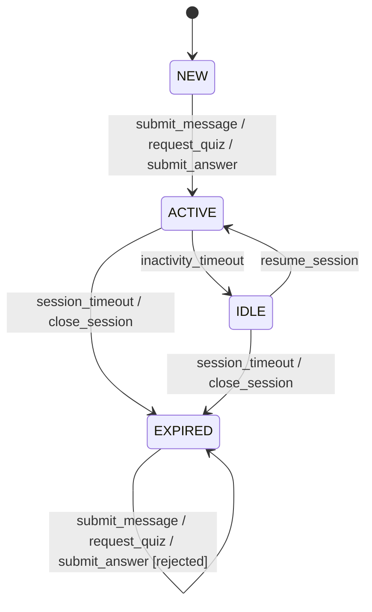

## 7.2

### Step 1 

### Step 2
| Current State | Event | Next State | Output / Action |
|---|---|---|---|
| `NEW` | `submit_message` | `ACTIVE` | Message accepted; session context updated |
| `NEW` | `request_quiz` | `ACTIVE` | Quiz request accepted; session context updated |
| `NEW` | `submit_answer` | `ACTIVE` | Answer accepted; session context updated |
| `NEW` | `inactivity_timeout` | – | Invalid; no action |
| `NEW` | `session_timeout` | – | Invalid; no action |
| `NEW` | `close_session` | – | Invalid; no action |
| `NEW` | `resume_session` | – | Invalid; no action |
| `ACTIVE` | `submit_message` | `ACTIVE` | Message accepted; inactivity timer reset |
| `ACTIVE` | `request_quiz` | `ACTIVE` | Quiz request accepted; inactivity timer reset |
| `ACTIVE` | `submit_answer` | `ACTIVE` | Answer accepted; inactivity timer reset |
| `ACTIVE` | `inactivity_timeout` | `IDLE` | Session marked idle |
| `ACTIVE` | `session_timeout` | `EXPIRED` | Session expired |
| `ACTIVE` | `close_session` | `EXPIRED` | Session closed |
| `ACTIVE` | `resume_session` | – | Invalid; no action |
| `IDLE` | `submit_message` | – | Invalid; no action |
| `IDLE` | `request_quiz` | – | Invalid; no action |
| `IDLE` | `submit_answer` | – | Invalid; no action |
| `IDLE` | `inactivity_timeout` | – | Invalid; no action |
| `IDLE` | `session_timeout` | `EXPIRED` | Session expired |
| `IDLE` | `close_session` | `EXPIRED` | Session closed |
| `IDLE` | `resume_session` | `ACTIVE` | Session restored; inactivity timer reset |
| `EXPIRED` | `submit_message` | `EXPIRED` | Rejected; return error: session expired |
| `EXPIRED` | `request_quiz` | `EXPIRED` | Rejected; return error: session expired |
| `EXPIRED` | `submit_answer` | `EXPIRED` | Rejected; return error: session expired |
| `EXPIRED` | `inactivity_timeout` | – | Invalid; no action |
| `EXPIRED` | `session_timeout` | – | Invalid; no action |
| `EXPIRED` | `close_session` | – | Invalid; no action |
| `EXPIRED` | `resume_session` | – | Invalid; no action |

### Step 3 

**Happy path**
Start: `NEW`

| # | Event | Expected State | Requirement |
|---|-------|---------------|-------------|
| 1 | `submit_message` | `ACTIVE` | FR-001 |
| 2 | `inactivity_timeout` | `IDLE` | FR-007 |
| 3 | `resume_session` | `ACTIVE` | FR-007 |
| 4 | `close_session` | `EXPIRED` | FR-007 |

**Session timeout from ACTIVE**
Start: `NEW`

| # | Event | Expected State | Requirement |
|---|-------|---------------|-------------|
| 1 | `request_quiz` | `ACTIVE` | FR-004 |
| 2 | `session_timeout` | `EXPIRED` | FR-007 |

**Session timeout from IDLE**
Start: `NEW`

| # | Event | Expected State | Requirement |
|---|-------|---------------|-------------|
| 1 | `submit_answer` | `ACTIVE` | FR-005 |
| 2 | `inactivity_timeout` | `IDLE` | FR-007 |
| 3 | `session_timeout` | `EXPIRED` | FR-007 |

**Invalid: interaction on EXPIRED**
Start: `EXPIRED`

| # | Event | Expected State | Expected Output | Requirement |
|---|-------|---------------|-----------------|-------------|
| 1 | `submit_message` | `EXPIRED` | Rejected; error: session expired | NFR-004 |
| 2 | `request_quiz` | `EXPIRED` | Rejected; error: session expired | NFR-004 |
| 3 | `submit_answer` | `EXPIRED` | Rejected; error: session expired | NFR-004 |

---

## 7.3 Reflection - Test Design Technique Comparison

### 1. Complementarity

**Equivalence Class Partitioning / Boundary Value Analysis**: This technique is useful in all scenarios where values can be grouped into classes, especially those with numeric values. Example: Requested question `count` which for example has to be between 1 and 10.

**Decision Tables**: This technique is useful for complex policy rules and combinations based on multiple conditions. Example: `Answer Evaluation` that combines three independent conditions.

**State Transition Testing**: This technique is useful for applications with stateful behavior or workflows. Example: `UserSession` that has four possible states and many possible workflows between them.

### 2. Gaps
The external AI inference is not testable with these techniques, because the AI outputs are not deterministic. The correctness, quality and hallucination rate of the AI responses cannot be tested with these techniques.

An alternative testing technique could be Exploratory Testing, where testers actively explore the system based on their experience and intuition and verify if the AI model perfomrs the task correctly and delivers expected results.

### 3. Effort vs. value
... produced the hightest defect-detection value relative to the design effort. ...

Equivalence Class Partitioning and Boundary Value Analysis are very helpful and worth the effort if the number of classes is limited.