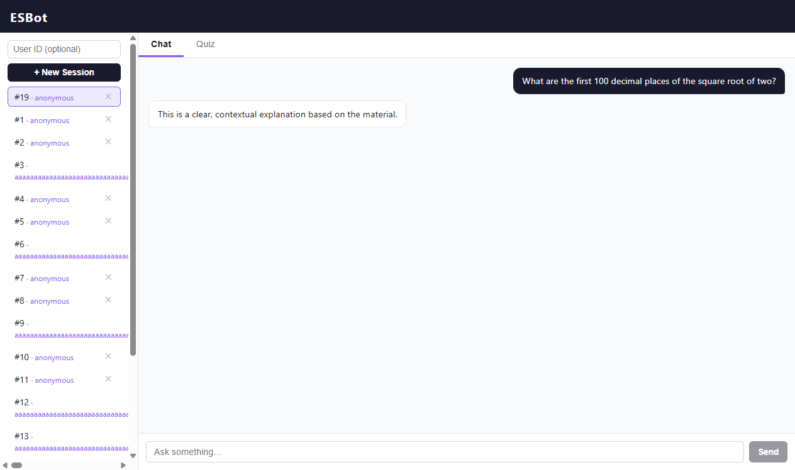
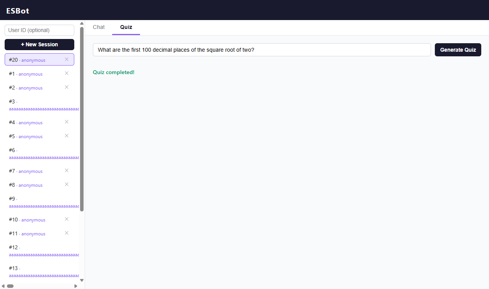
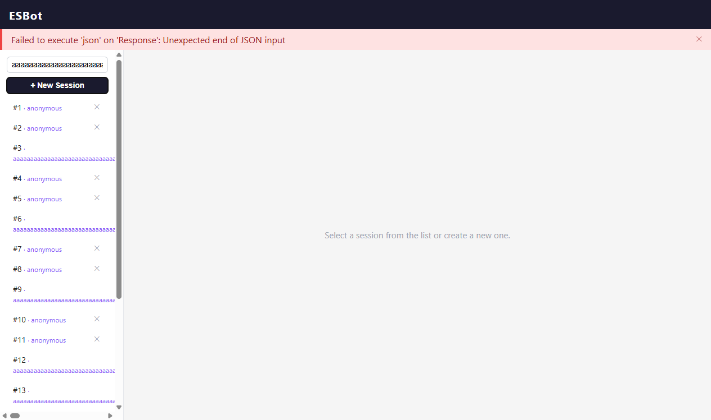

# Exercise 11.3 — E2E Execution, Recording, and Reflection

This report records the execution of the ESBot E2E suite in both **headless**
(CI-style) and **interactive/headed** mode, documents a flakiness issue that was
discovered and fixed, and reflects on the experience.

---

## 1. Test execution summary

| Item | Value |
|------|-------|
| Framework | Selenium 4.45.0 + pytest 8.3.5 (Python) |
| Driver | ChromeDriver (auto-provisioned by Selenium Manager) |
| Browser | Google Chrome 149.0.7827.115 |
| Runtime | Python 3.11.9 |
| OS | Windows 11 (10.0.26200) |
| Backend | FastAPI / uvicorn on `http://localhost:8000`, `MockAIInference` (deterministic) |
| Frontend | Vue 3 + Vite 6 dev server on `http://localhost:5173` (proxying `/api` → 8000) |
| Test file | [`frontend/e2e/selenium/test_messages_quiz.py`](../../frontend/e2e/selenium/test_messages_quiz.py) |
| Tests run | 3 |
| Result (headless) | **3 passed / 0 failed** |
| Result (headed) | **3 passed / 0 failed** (after the fix in 4) |
| Total runtime | ~30 s headless, ~32 s headed |

The three automated flows:

| Test | Flow | Type |
|------|------|------|
| `test_chat_message` | Create session → send chat message → assistant reply visible | Positive |
| `test_quiz_generation` | Create session → generate quiz → answer questions → "Quiz completed!" | Positive |
| `test_too_long_user_id_error` | Over-long user ID → error banner shown to the user | Negative / error |

All assertions follow the exercise guidance: stable `data-testid` selectors only,
`WebDriverWait` + `expected_conditions` for async waits (no fixed `sleep()`), and
no assertions on exact mock LLM text (only the known mock substring
`"contextual explanation"`).

---

## 2. Headless output (CI-style)

Command:

```bash
# backend (terminal 1)
export DATABASE_URL="sqlite:///./e2e_test.db"
uvicorn backend.app:app --host 127.0.0.1 --port 8000

# frontend (terminal 2)
cd frontend && npm run dev

# tests (terminal 3) — headless is the default
python -m pytest frontend/e2e/selenium/ -v
```

Output:

```text
============================= test session starts =============================
platform win32 -- Python 3.11.9, pytest-8.3.5, pluggy-1.5.0
cachedir: \tmp\.pytest_cache
rootdir: C:\Users\yunis\Documents\GitHub\esbot
configfile: pytest.ini
plugins: anyio-4.13.0, django-4.11.1
collecting ... collected 3 items

frontend/e2e/selenium/test_messages_quiz.py::test_chat_message PASSED    [ 33%]
frontend/e2e/selenium/test_messages_quiz.py::test_quiz_generation PASSED [ 66%]
frontend/e2e/selenium/test_messages_quiz.py::test_too_long_user_id_error PASSED [100%]

============================= 3 passed in 29.79s ==============================
```

---

## 3. Interactive / headed run

Selenium has no separate "test runner" UI like Cypress — the tests simply drive a
**visible** Chrome window. To run headed instead of headless, the `conftest.py`
driver fixture was made configurable via an environment variable (default stays
headless so CI is unaffected):

```bash
# Watch the tests run in a real Chrome window:
ESBOT_HEADLESS=0 python -m pytest frontend/e2e/selenium/ -v
```

Headed output:

```text
collecting ... collected 3 items

frontend/e2e/selenium/test_messages_quiz.py::test_chat_message PASSED    [ 33%]
frontend/e2e/selenium/test_messages_quiz.py::test_quiz_generation PASSED [ 66%]
frontend/e2e/selenium/test_messages_quiz.py::test_too_long_user_id_error PASSED [100%]

============================= 3 passed in 32.44s ==============================
```

Screenshots captured from the visible Chrome window at the moment each flow's
assertion passes:

**Chat flow — assistant reply visible (passing):**



**Quiz flow — "Quiz completed!" feedback (passing):**



**Negative flow — error banner shown for an over-long user ID (passing):**



---

## 4. Flakiness observations

**Yes — one test was flaky and it was traced to a root cause and fixed.**

### Symptom

`test_too_long_user_id_error` **passed in headless mode** (twice in a row) but
**failed in headed mode** with `NoSuchElementException` — the `error-banner`
element was never present:

```text
>       error_banner = driver.find_element(By.CSS_SELECTOR, '[data-testid="error-banner"]')
E       selenium.common.exceptions.NoSuchElementException: Message: no such element:
E       Unable to locate element: {"method":"css selector","selector":"[data-testid=\"error-banner\"]"}
FAILED frontend/e2e/selenium/test_messages_quiz.py::test_too_long_user_id_error
======================== 1 failed, 2 passed in 35.69s =========================
```

### Root cause — a race condition (not the framework)

The original test typed a 20 000-character user ID and clicked **New Session**.
That single click triggers **two concurrent requests** that both mutate the same
shared `error` state in `App.vue`:

1. Clicking the button **blurs** the user-id input, firing `@change="fetchSessions"`,
   which issues `GET /api/v1/sessions?user_id=<20000 chars>`. Through the Vite dev
   proxy this URL exceeds the HTTP header limit and returns **431 Request Header
   Fields Too Large**. The 431 body is not JSON, so `res.json()` throws and the
   `catch` sets `error` → the **banner appears**. (This is the message visible in
   the screenshot: *"Failed to execute 'json' on 'Response': Unexpected end of JSON input"*.)
2. The same click also calls `createSession()` → `POST /api/v1/sessions` with the id
   in the **body**. The body is not subject to the header limit, so this returns
   **201 Created** and succeeds. The `api()` helper resets `error = null` at the
   start of every call, so the successful POST path **clears the banner**.

Verified directly against the proxy:

```text
GET  /api/v1/sessions?user_id=<20000 'a'>   -> 431   (fails  -> banner shown)
POST /api/v1/sessions  body user_id=<20000> -> 201   (succeeds -> banner cleared)
```

Whether the banner is still visible at assert time depends on which of the two
concurrent operations finishes last — pure timing. Headless and headed Chrome
schedule events slightly differently, so the test passed in one mode and failed in
the other. This is a  **state-leakage / race** flake, not a tooling bug.

### Fix

The negative test now triggers **only the failing path** deterministically: it
types the over-long id and blurs the field with `TAB` (firing the 431 session
lookup) without also firing the competing successful POST, then waits for the
banner with `WebDriverWait`:

```python
user_id_input.send_keys("a" * 20000)
user_id_input.send_keys(Keys.TAB)  # blur -> @change -> session lookup -> 431
error_banner = wait.until(
    EC.visibility_of_element_located((By.CSS_SELECTOR, '[data-testid="error-banner"]'))
)
assert error_banner.is_displayed()
```

After the fix the suite is **green in both headless and headed mode** (3/3, 2 & 3),
across repeated runs.

### Other observations

- **DB state accumulation:** the backend uses a persistent SQLite file, so sessions
  pile up across runs (visible in the left sidebar of the screenshots). The tests
  are still correct because each test creates its own fresh session, but a clean DB
  per run (or a unique `user_id` per test) would make the environment tidier.
- **No LLM-driven flakiness:** chat/quiz responses come from `MockAIInference`, which
  is fully deterministic, so the positive flows never flaked.

---

## 5. Reflection

### What was easy about writing E2E tests compared to unit or API tests?

The tests read like a description of what a real user does click *New Session*,
type a message, expect a reply so they are intuitive and need almost no knowledge
of the internal code. Because the frontend exposes stable `data-testid` attributes,
selecting elements was trivial and robust, and a single E2E test exercises the whole
stack (browser → Vite proxy → FastAPI → DB → mock LLM) at once, giving high
confidence from very few tests.

### What was difficult or surprising?

The asynchronous, concurrent nature of the UI. The negative test looked trivial but
hid a genuine race condition that only appeared in headed mode — a reminder that E2E
tests are inherently timing-sensitive and that "passes on my machine / in headless"
is not the same as "deterministic." Debugging required reasoning about event ordering
(`change` vs `click`), the dev-proxy's 431 behaviour, and shared `error` state in the
SPA — much more than a unit test would ever demand. It was also surprising how much
slower E2E is (~10 s per test for browser startup + navigation) compared to
millisecond-level unit tests.

### At which layer of the test pyramid would each bug be detected, and why?

| Bug class | Best layer | Why |
|-----------|-----------|-----|
| Wrong answer-generation / quiz logic | **Unit** | Pure functions (`MockAIInference`, `submitAnswer`) are fastest and most precise to test in isolation. |
| Wrong status codes / payloads / validation (e.g. 404, 422) | **API** | HTTP contract is verified directly without a browser; fast and deterministic. |
| The 431 + error-banner race; proxy routing; wiring of click → fetch → render | **E2E** | Only a real browser going through the Vite proxy exposes the concurrent event timing and the non-JSON 431 body — invisible to unit/API tests. |

The principle: push each check to the **lowest layer that can still catch it**. Logic
bugs belong in unit tests, contract bugs in API tests, and only genuinely
integration/timing/rendering bugs justify the cost of E2E.

### How would these tests behave with a real (non-mock) LLM, and what would you change?

They would become **slow and flaky**. A real LLM adds variable latency (seconds, not
milliseconds) and non-deterministic wording, so the fixed assertion
`"contextual explanation" in answer.text` would fail, and quiz questions/options
would vary every run. Changes I would make:

- Keep the deterministic **mock provider as the default for CI** so E2E stays fast and
  stable; run real-LLM tests only in a separate, non-blocking nightly job.
- Replace text-equality assertions with **structural/semantic** checks: a reply is
  non-empty, rendered in the `assistant-message` bubble, within a length range, and
  (optionally) topically relevant via a lightweight semantic check.
- Increase and make **timeouts configurable**, and add ret/retry-with-backoff for
  transient model errors.
- Generate quizzes with a fixed seed / temperature 0 where the provider supports it to
  reduce variance.

---

## Notiz zur KI-Nutzung

**Tool Used:** Claude Sonnet

**Purpose:** Claude Sonnet wurde unterstützend eingesetzt für:
- die **sprachliche Formulierung** und Strukturierung dieses Reports,
- das **Verstehen der Race Condition** (Zusammenspiel aus `@change`/`click`,
  dem 431 des Vite-Dev-Proxys bei zu langer URL und dem geteilten `error`-State
  in `App.vue`),
- sowie ggf. **Hilfestellung beim Fix** des flaky Negativtests (deterministisches
  Auslösen nur des fehlerhaften Pfads + `WebDriverWait` statt `find_element`).

Ausführung der Tests, Verifikation der Ergebnisse und die finalen Entscheidungen
wurden eigenständig vorgenommen und überprüft.
